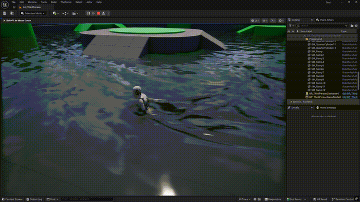

# UE5 Interactive Water Simulation

基于 Unreal Engine 5 的交互式水面模拟 Demo。  
使用 `SceneCapture2D`、`Render Target` 和材质图，实现角色 / 物体与水面的实时交互效果。

## Preview



## Features

- 角色 / 物体与水面实时交互
- SceneCapture2D 捕获交互对象
- Render Target 记录高度场
- 三缓冲实现波纹扩散
- 高度图生成动态法线
- 水面材质接入 WPO 和 Normal

## Pipeline

```text
Actor
→ SceneCapture2D
→ RT_Capture
→ WaveCompute
→ Height RT
→ WaveSimulation
→ WaveNormal
→ Water Surface Material
